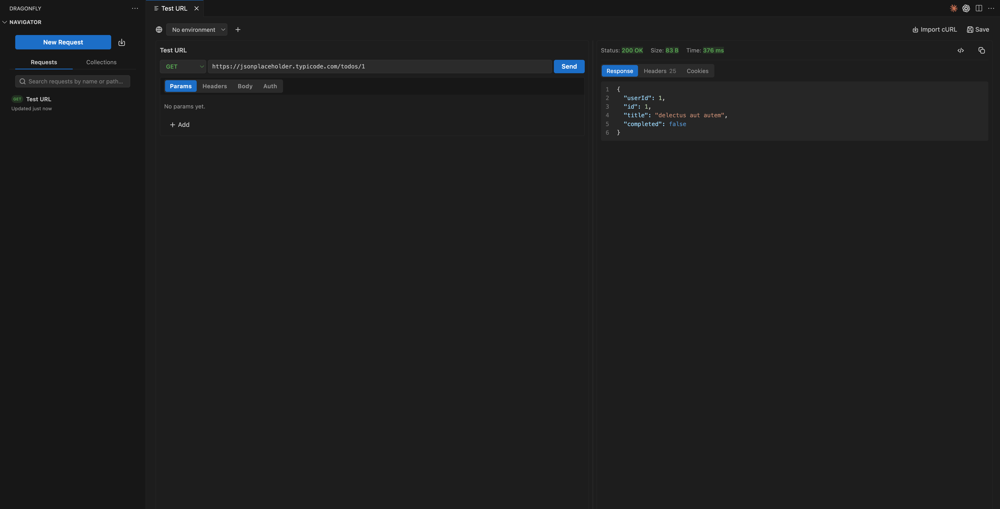

  

<h1 align="center">Dragonfly: REST API Client for VS Code</h1>

  Send HTTP requests, organize them into collections, and pull the API routes you
  already wrote straight out of your codebase. All without leaving the editor.

  
  

  

> **Beta.** This is still early, so expect rough edges. Bug reports and feedback are
> very welcome at saurowankhade@gmail.com.

## What it does

Most API clients hand you an empty request and let you type the URL in yourself.
Dragonfly can read your project first. Run a scan and it picks up your Express and
Next.js routes, then turns them into a collection, so the endpoints you already
wrote are ready to send.

Everything stays on your machine. Collections, environments and request history
live in VS Code's own storage, tokens and passwords go into VS Code's secure
storage instead of a JSON file, and the extension itself never talks to a server.
**No account, no sign-in, no paid tier.**

## Features

- **Request builder**: method, URL, params, headers, body and auth, docked in the Activity Bar
- **Route discovery**: scan a workspace for Express and Next.js routes (App Router and Pages Router) and build a collection from them, then re-scan to pick up new or deleted routes
- **Collection import**: bring over Postman (v1 and v2), Thunder Client, Insomnia or a HAR capture, with folders, requests, headers, query params and bodies intact. One **Import Collection** command detects the format for you
- **Environment import**: Postman, Thunder Client and Insomnia environments come across, so `{{baseUrl}}` in an imported request actually resolves
- **OpenAPI and Swagger import**: one request per operation, grouped into folders by tag, with path params turned into `{{variables}}`
- **cURL import**: paste a cURL command from Postman, browser devtools, Swagger UI or a docs page, and the form fills itself in
- **Collections**: save and organize requests, with folders and search
- **Environments**: `{{variable}}` substitution across requests, one click to switch
- **Auth**: Bearer Token, API Key and Basic Auth, with the secret half kept in VS Code's secure storage
- **Code snippets**: copy any request out as cURL, Node.js, Python, Go, PHP, Java or Rust
- **Request history**: every request you send is saved to Activity, ready to open again or resend

## Getting started

1. Install Dragonfly from the [VS Code Marketplace](https://marketplace.visualstudio.com/items?itemName=saurabhwankhade.dragonfly), or run `ext install saurabhwankhade.dragonfly` from Quick Open.
2. Open the Dragonfly icon in the Activity Bar.
3. Run **Scan Workspace for Routes** from the Command Palette, or click **New Request**.
4. Fill in the request and hit **Send**. Save it into a collection to keep it around.

## How it compares

Dragonfly focuses on one job and does it well: it reads your codebase and builds
your requests for you, instead of making you type every endpoint in by hand. It
does not try to replace Postman or Insomnia for team workspaces, mock servers or
scripted test suites. If your day-to-day is testing the endpoint you are working
on right now, this is built for exactly that.

|                                       | Dragonfly             | Postman                   | Thunder Client      | Insomnia            |
| ------------------------------------- | --------------------- | ------------------------- | ------------------- | ------------------- |
| Runs in the VS Code sidebar           | Yes                   | Separate extension        | Yes                 | No, standalone app  |
| Builds requests by scanning your code | Yes, Express, Next.js | No                        | No                  | No                  |
| Imports Postman collections           | Yes                   | Yes                       | Yes                 | Yes                 |
| Imports Thunder Client, Insomnia, HAR | Yes                   | Partial                   | Partial             | Yes                 |
| Imports OpenAPI or Swagger specs      | Yes                   | Yes                       | Yes                 | Yes                 |
| Imports cURL commands                 | Yes                   | Yes                       | Yes                 | Yes                 |
| Account needed to use it              | No                    | Sign-in for most features | No                  | Optional            |
| Price                                 | Free, MIT             | Free tier plus paid       | Free tier plus paid | Free tier plus paid |

## FAQ

**How do I test an API endpoint inside VS Code?**
Install Dragonfly and open it from the Activity Bar. Build the request in the
sidebar (method, URL, headers, body, auth) and press **Send**. The response shows
up next to your code, so there is no second app to switch to.

**Can it find the API routes in my project automatically?**
Yes. Run **Scan Workspace for Routes** and it parses your source for Express route
handlers and Next.js API routes, then builds a collection from what it finds. Run
it again after you add endpoints and it picks up the changes.

**Which frameworks does route discovery support?**
Express and Next.js, covering both the App Router and the Pages Router. For
anything else, import an OpenAPI spec, a Postman / Thunder Client / Insomnia
collection, a HAR capture, or a single cURL command.

**Where does my data go?**
Only the API you are calling needs the network. The extension never contacts a
server of its own. Collections, environments and history sit in VS Code's storage
on your machine, and tokens and passwords go into VS Code's secure storage.

**Is it free?**
Yes. No account, no paid tier, no telemetry.

## Feedback

Email saurowankhade@gmail.com. Steps to reproduce help a lot, and feature requests
are welcome, especially which framework route discovery should learn next.

## Connect

MIT licensed.
